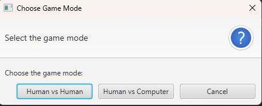
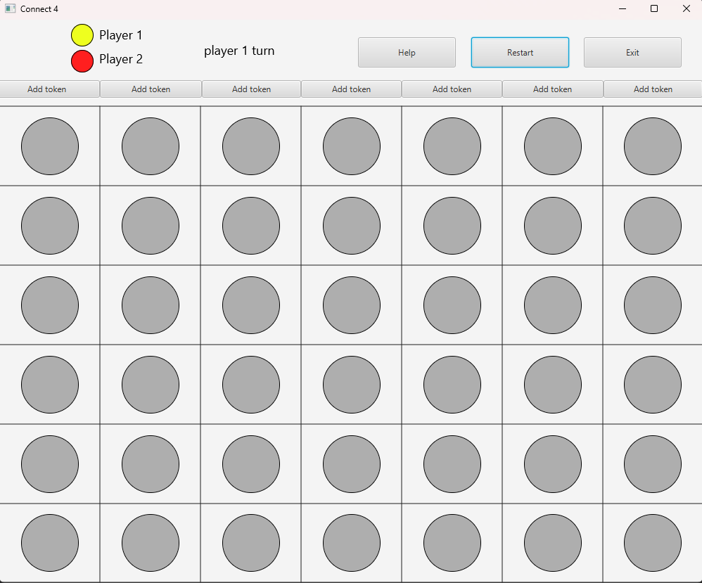
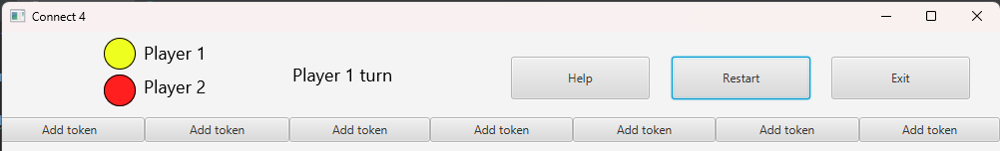

# ihm-connect-4

Implémentation du jeu Connect 4 avec JavaFX.

Réalisé par : Othmane JEDDAD et Yahya EL AILI.

Dans l'ensemble du projet, tout est rédigé en anglais (les classes, les méthodes et les commentaires) (nous sommes plus à l'aise pour coder en anglais qu'en français).

Dans ce projet, nous avons cherché à maximiser l'ergonomie de l'IHM.

Ci-dessous, des exemples provenant de notre IHM.

Au début du jeu, l'utilisateur a le choix entre deux modes de jeu : "humain contre humain" ou "humain contre l'ordinateur".

Nous avons essayé de construire une fenêtre contextuelle minimaliste avec des options clairement visibles pour l'utilisateur.

Dans l'IHM principale du jeu, nous avons créé une grille de jeu avec différents boutons permettant d'ajouter un jeton dans une colonne, d'afficher les règles du jeu, de recommencer une partie ou de quitter le jeu.

Nous avons ajouté un en-tête contenant les informations nécessaires pour le joueur, telles que la couleur et le joueur actuel, ainsi que des boutons utiles.

Des fenêtres contextuelles informatives ont également été intégrées, fournissant à chaque fois des informations utiles à l'utilisateur en fonction du contexte.